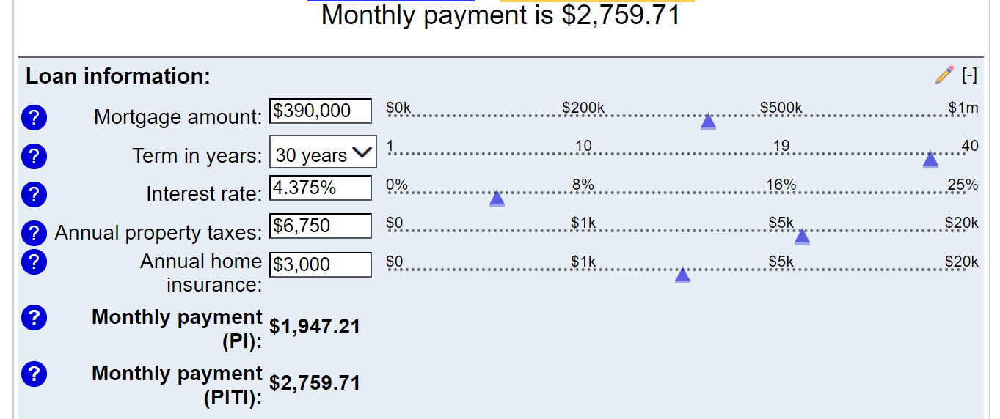
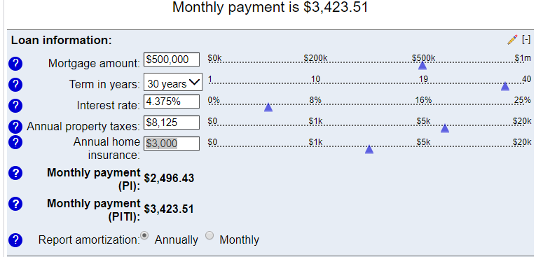
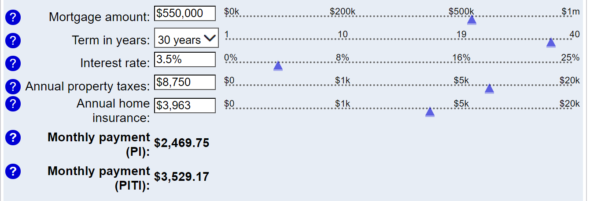
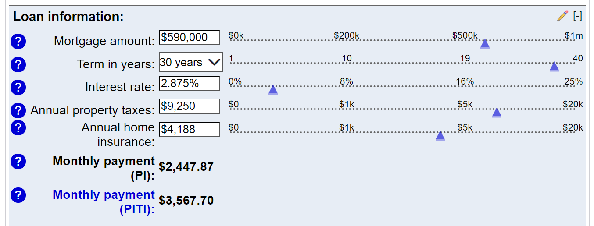

## Calculating Home Affordability

This is some guidance so you can understand the math of the problem.

### If there's no on-property rental

Our budget for monthly house payments  -- if the Montessori bill goes away -- is about $3500. 

That's based on the view that we're basically not-quite-breaking even each year with the current pattern, where our house payment on Yale is about \$1650, and the school cost is \$1850, so that's \$3500/month.   With a bit of belt-tightening, we ought to be able to balance the books that way, but certainly we don't want to pile on a whole lot more monthly net housing cost.

If you talk to a banker, they'll talk about a 30% upper limit relative to gross salary *(which is `$252k * .3 / 12 = $6300`, but we are running an expense rate with several years of history, and two separate homes, and travel and educational expenses, etc.  So we have reason to be confident about knowing what we can afford per month. )*  -- the question is how to spend that $3500/mo and how much risk to take on and whether an on-site rental can help.

So what does that mean in terms of home prices?   I suggest you spend some time [with this calculator](https://www.bankrate.com/calculators/mortgages/mortgage-payment-calculator.aspx), and consider the following concepts about the different field values:

1.  The number that matters is **"PITI"** *(principal+interest+taxes+insurance)*: that's the total monthly cost of the home.  *(Often mortgage calculators leave out taxes+insurance, which means they're not something you can use as the basis for a decision.  This calculator includes those fields, but you have to know how to determine them.)*

2. Here's a projection **if we bought the Yale house today,** at an assumed \$540k market price, with a 30-year fixed loan like the one we already have `(@4.375%)`, putting a $150K down payment from the sale of a fictional former home.  That would be a sort of straight-across trade: buying a similar-value home after selling the current one. *(Note that the "Mortgage Amount" field in the calculator refers to the amount being borrowed, so I've already subtracted the down payment before filling that in.)*

That scenario yields a monthly payment of \$2760: well below the \$3500 budget.  We can definitely afford a $540k house.

---

3.  **What about \$650k?**  Taxes go up, and insurance goes up.  The taxes are generally going to be 1.25% of the property value, unless you buy something in a region with some sort of special assessment exception which drives them higher.  Be sure to watch for that, it can be significant.   Most homes won't have that problem.   Insurance I am calculating by just doing a prorata on our current insurance, which is about \$1500/year.  The other parameters are the same: 4.375% fixed mortgage, $150k down payment:

So that eats up the \$3500/month.  That's the reason why I've been talking about \$650k as the upper limit on a house with no rental option.

---

4.  **However...**  as the realtor suggests, we might well be able to get a better interest rate.  How much difference does it make?  I'm seeing rates of 3.5% from Wells Fargo advertised on the very site that hosts the calculator.  So then what does our budget buy if we can get that rate?

That moves the needle up to *\$700k* for the home price.  Still a bit shy of the typical homes in Claremont, I believe, but might expand the options a bit.

---

5. **What about an ARM?**  Adjustable rate mortgages at least start with lower monthly payments, but the buyer assumes the interest rate risk... if the base rate moves up, your monthly payments go up.  Best I can tell, it might be possible to get down to 2.875% with an ARM in our situation, if we take that risk:

This scenario requires \$152k as a down payment, because of the 20% floor to avoid "mortgage insurance", but now the upper limit on home price is **$740k**.  Maybe there's more inventory available at that price?

While it is possible to get above that level with a lower down payment, mortgage insurance adds quite a bit of expense, and we're back to the problem of the monthly payment.

---
6. Things to remember:
- We will need a new HELOC on the new house, because there still needs to be a bucket for educational expenses.
- Nothing in the scenarios above allocate anything for improvements to the new home or furniture replacements, appliances, etc.  Presumably some of that would need to happen, possibly from the new HELOC?

## What if there's a rental attached?

For every $1,000 of rental revenue, some portion has to be allocated for expenses, and the rest can go to a higher house payment.  In theory.  But figuring out what those expenses might be isn't easy, and the tax consequences are potentially significant, as any profit (revenue minus expense) is going to be treated as income by the IRS, California, and New Jersey *(yes, we file New York and New Jersey returns every year, but not California.  With rental income we would have to file in California as well!)*

We want to minimize taxes but they are partly offset by the ability to "depreciate" the property over time. So it's complicated.

Let's assume that a conservative estimate is that 70% of rental revenue can be applied to PITI for the property... so if you have a unit that can be rented for \$1000/month, then that gives $700 for the PITI payments, and can't you just plug that into the calculator to figure out a new upper-limit on price?

Sort of, a bit.  Except the trouble is that a higher home price correlates with a higher down payment, and I think that $150k is getting close to the limit of what we can count on as a down payment, without extraordinary measures like "save up for X months to have extra down payment."   If the down payment falls below 20%, the interest rate might start creeping up.  If we borrow (e.g. on a credit card) to get more down payment, that can show up on credit reports as a score hit.  It is possible to finesse these bits, and it's possible that the banks will be hungrier to lend than we know, etc.

So basically paying attention to attached rentals isn't a bad idea, but it's hard to give a preliminary yes/no about a given property and say "yes, we could make that work", at least without finding a lender who agrees.

