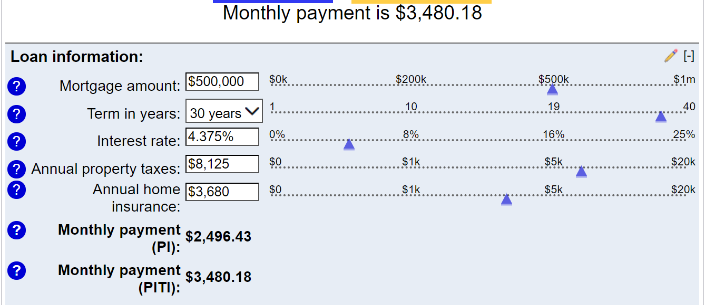

# Calculating Home Affordability

## Calculating Home Affordability

This is some guidance so you can understand the math of the problem.

### If there's no on-property rental

This is some guidance so you can understand the math of the problem.

Our budget for monthly house payments  -- if the Montessori bill goes away -- is about $3500.  That's based on the view that we're basically not-quite-breaking even each year with the current pattern, where our PITI house cost is about $1650, and the school cost is $1850, so that's $3500/month.   With a bit of belt-tightening, we ought to be able to balance the books that way, but certainly we don't want to pile on a whole lot more monthly net housing cost.

So what does that mean in terms of home prices?   I suggest you spend some time [with this calculator](https://www.bankrate.com/calculators/mortgages/mortgage-payment-calculator.aspx), and consider the following concepts about the different field values:

1.  The number that matters is **"PITI"** *(principal+interest+taxes+insurance)*: that's the total monthly cost of the home.  *(Often mortgage calculators leave out taxes+insurance, which means they're not something you can use as the basis for a decision.  This calculator includes those fields, but you have to know how to determine them.)*

2. Here's the projection if we bought the Yale house today, at an assumed $540k market price, with a 30-year fixed loan like the one we already have *(@4.375%)*, putting a $150K down payment from the sale of a fictional former home.  The 

